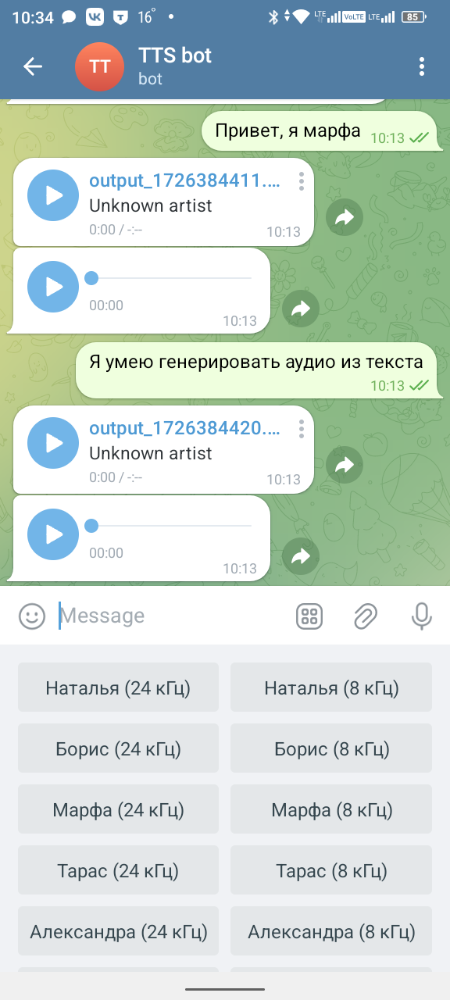
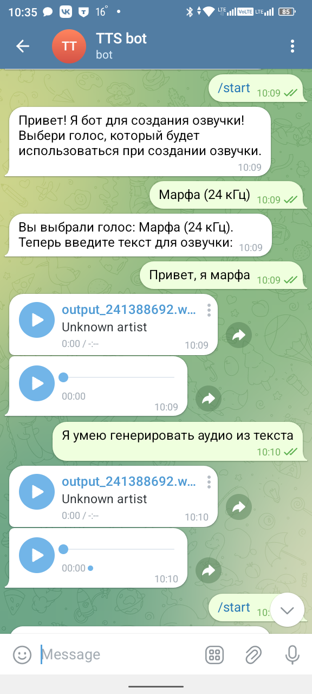

# TTS Bot (Text-to-Speech Telegram Bot)

Telegram бот для преобразования текста в речь с использованием Salute Speech API от Сбера.




## Возможности

- Преобразование текста в речь с помощью различных голосов
- Поддержка 14 различных голосов (7 дикторов с двумя вариантами качества)
- Отправка результата в двух форматах: аудиофайл и голосовое сообщение
- Удобный интерфейс с кнопками для выбора голоса

## Примеры сгенерированных аудио

- [Пример 1](source/output_1747386043.wav)
- [Пример 2](source/output_1747386125.wav)
- [Пример 3](source/output_1747386254.wav)

## Используемые технологии

- Python 3.12
- pyTelegramBotAPI (telebot) - для работы с Telegram Bot API
- Salute Speech API - для синтеза речи
- python-dotenv - для работы с переменными окружения
- requests/aiohttp - для HTTP запросов
- pydub - для работы с аудиофайлами

## Установка и настройка

1. Клонируйте репозиторий:

```bash
git clone [URL репозитория]
cd TTS_bot
```

2. Установите зависимости:

```bash
pip install -r requirements.txt
```

3. Создайте файл .env и добавьте необходимые переменные окружения:

```env
API_KEY='your_api_key_here'
BOT_TOKEN='your_bot_token_here'
CLIENT_ID='your_client_id_here'
CLIENT_SECRET='your_client_secret_here'
CLIENT_AUTH='your_client_auth_here'
```

4. Запустите бота:

```bash
python main.py
```

## Структура проекта

- `main.py` - основной файл бота
- `voice.py` - модуль для работы с Salute Speech API
- `config.py` - конфигурация и словари голосов
- `get_token.py` - получение токена для Salute Speech API
- `requirements.txt` - зависимости проекта
- `.env` - файл с переменными окружения (не включен в репозиторий)
- `src/` - директория со скриншотами
- `source/` - директория с примерами аудиофайлов

## Доступные голоса

- Наталья (24 кГц / 8 кГц)
- Борис (24 кГц / 8 кГц)
- Марфа (24 кГц / 8 кГц)
- Тарас (24 кГц / 8 кГц)
- Александра (24 кГц / 8 кГц)
- Сергей (24 кГц / 8 кГц)
- Kira (24 кГц / 8 кГц) — синтез английской речи

## Как использовать

1. Начните диалог с ботом командой `/start`
2. Выберите голос из предложенного списка
3. Отправьте текст, который хотите преобразовать в речь
4. Получите результат в виде аудиофайла и голосового сообщения

## Примечания

- Для работы бота необходим доступ к Salute Speech API (требуется регистрация)
- Рекомендуется использовать тексты умеренной длины для оптимальной работы
- Поддерживается русский и английский языки (зависит от выбранного голоса)

## Лицензия

[MIT License](LICENSE)
